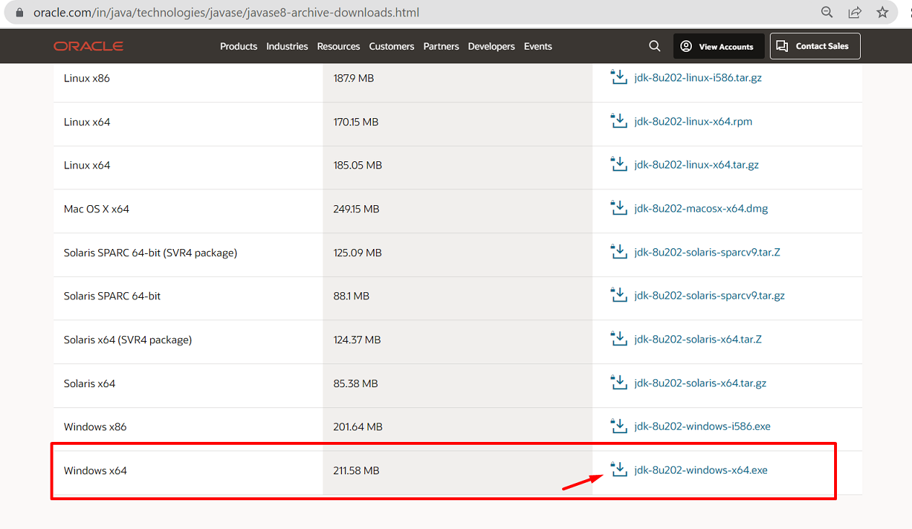
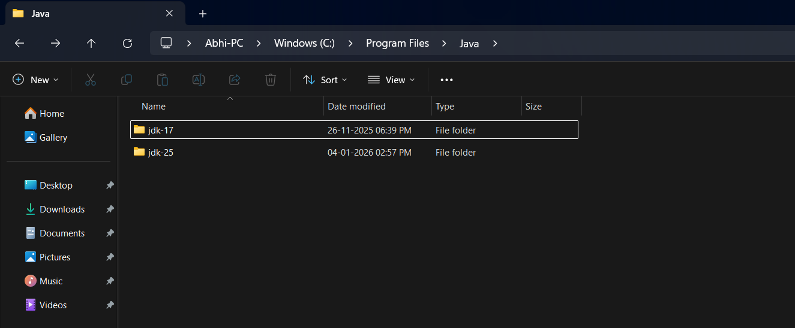
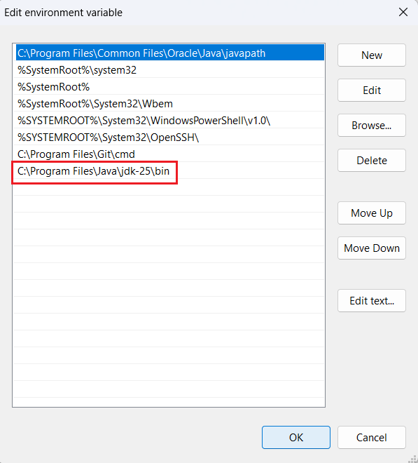
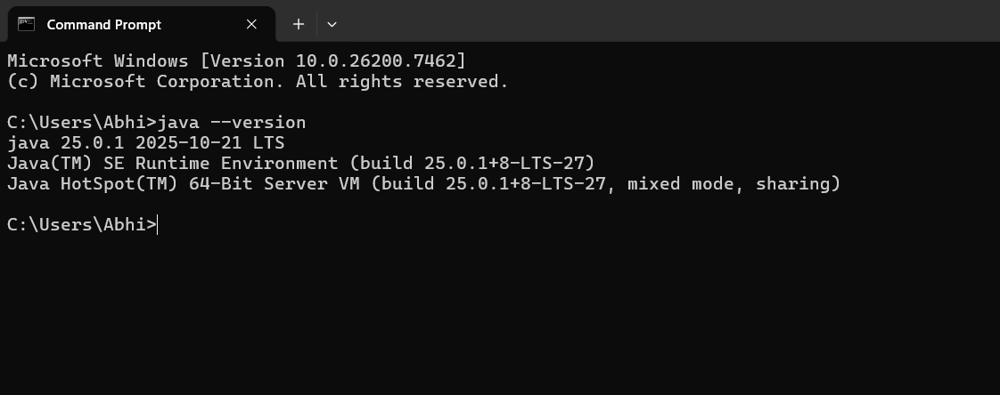

# Session 1 - Introduction to Java
## What is Java ?
- Java is a programming language
- Java developed by James Gosling & his team in 1991 at Sun Microsystems
- Initially they named it as `OAK` programming language
- In 1995, OAK language renamed to Java
- Oracle Corporation acquired Sun Microsystem in 2010
- Now java is under license of Oracle corporation
- Java is a free & open-source software
- 3 billion devices run on Java language
- Java is one of the most popular languages in the world
- Java can run on any platform (It is platform independent)
- Latest version of Java is Java 25 (LTS)
## Java Features
#### Simple
- Java is easy to learn and its syntax is quite simple, clean and easy to understand. The confusing and ambiguous concepts of C++ are either left out in Java or they have been re-implemented in a cleaner way.

		Eg: Pointers and Operator Overloading are not there in java
#### Platform Independent
- Unlike other programming languages such as C, C++ etc which are compiled into platform specific machines. Java is guaranteed to be write-once, run-anywhere language.
- When we compile java code it will generate bytecode. This bytecode is platform independent and can be run on any machine, plus this bytecode format also provide security. Any machine with Java Runtime Environment can run Java Programs.


#### OOP Language
- Java is an object-oriented programming language. Everything in Java is an object. Object-oriented means we organize our software as a combination of different types of objects that incorporate both data and behaviour.
- Object-oriented programming (OOPs) is a methodology that simplifies software development and maintenance by providing some rules.
- OOPs Principles are:

			Object
			Class
			Inheritance
			Polymorphism
			Abstraction
			Encapsulation
#### Secure
- When it comes to security, Java is always the first choice. With java secure features it enables us to develop virus free, temper free system. Java program always runs in Java runtime environment with almost null interaction with system OS, hence it is more secure.
#### Multi-Threading
- Java multithreading feature makes it possible to write program that can do many tasks simultaneously. Benefit of multithreading is that it utilizes same memory and other resources to execute multiple threads at the same time, like While typing, grammatical errors are checked along.
#### Architectural Neutral
- Compiler generates bytecodes, which have nothing to do with a particular computer architecture, hence a Java program is easy to interpret on any machine.
#### Portable
- Java Byte code can be carried to any platform. No implementation dependent features. Everything related to storage is predefined.

			Eg: size of primitive data types
#### High Performance
- Java is an interpreted language, so it will never be as fast as a compiled language like C or C++. But Java enables high performance with the use of just-in-time compiler.
#### Distributed
- Java is also a distributed language. Programs can be designed to run on computer networks. Java has a special class library for communicating using TCP/IP protocols. Creating network connections is very much easy in Java as compared to C/C++.
### Difference between JDK, JRE & JVM ?
- JDK contains set of tools to develop java programs
- JRE providing a platform to run our java programs
- JVM will take care of program execution
## Java program Execution Flow
**Step-1:** We will write source code and we will save that code in a file using `.java` extension
**Step-2:** We will compile source code using java compiler (it will generate byte code)
**Step-3:** We will execute `.class` file ( JVM will convert byte code into machine code & gives output)


## Bytecode
- The output of a Java compiler is not executable code. Rather, it is bytecode
- Bytecode is a highly optimized set of instructions designed to be executed by the Java run-time system
- Bytecode makes Java platform-independent
## JVM
- JVM stands for Java Virtual Machine (We can't see with our eyes)
- JVM will be part of JRE
- JVM is responsible for executing java programs
- JVM will allocate memory required for program execution & de-allocate memory when it is not used
- JVM will convert byte code into machine understandable format
## First Java Program Structure
		Package statement
		Import statement
		Class
		Variable
		Methods

 - Package statement is used to group our classes. At most we can write only one package statement in one java program and package statement should be the first statement in the program.
 - Import statements are used to import one program into another program. We can write multiple import statements in one program (It depends on requirement). We should write import statements after package statement only.
 - Class is the most import part in java program. Class is a plan to define program elements. Inside class we will write variables and methods.
 - Variables are used to store the data. We can write any no. of variables inside a class.
 - Methods are used to perform action. Application business logic we will write inside methods. A can class can have any no. of methods.
```java
	class Test {
		public static void main(String... args){
			System.out.println("Welcome to Java !!");
		}
	}
```
## Environment Setup (Java Installation)
#### Step- 1) Download and Install Java Software

- After installing java, we can see below folder (JDK)

**Note: If you installed java first time you'll see only one folder containing the version you installed. (Here Java 17 is previously installed on this system that's why there are two folders)**
**Note: After installing java software, we need to set PATH for java software to use it.**
#### Step-2) Set Path for Java
- Go To Environment Variables
- Go To System Environment Variables
- Edit Path
- Add path up to JDK bin directory
			Path = C:\Program Files\Java\jdk-25\bin


#### Step-3) Verify PATH Setup
- Open command prompt and execute below command


**Note: If you are getting message like above that means, java installation and PATH setup is success.**
### Assignments (LeetCode)
1) [Two Sum](https://leetcode.com/problems/two-sum/)
2) [Add Digits](https://leetcode.com/problems/add-digits/)
