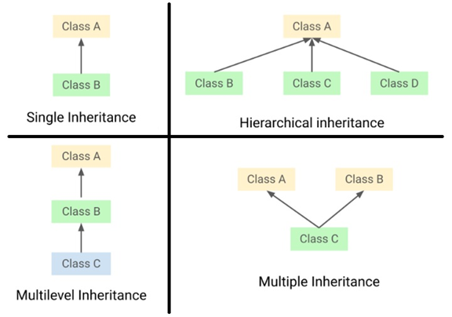

# Session 10 - Inheritance & Polymorphism
## OOPS
- Object-oriented programming (OOPs) is a methodology that simplifies software development and maintenance by providing some rules
- OOPs Principles are

			Encapsulation
			Inheritance
			Polymorphism
			Abstraction
### Encapsulation
- It is used for data hiding
- We will combine variables & methods as one single unit using Class

```java
	public class Account {
		private int accNum;
		private String name;

		public void setAccNum(int accNum) {
			this.accNum = accNum;
		}

		public int getAccNum() {
			return this.accNum;
		}

		public void setName(String name) {
			this.name = name;
		}

		public String getName() {
			return this.name;
		}
	}

	public class Test {
		public static void main(String[] args) {
			Account obj = new Account(); // obj creation
			obj.setAccNum(797979);
			obj.setName("Arpit");

			int accNum = obj.getAccNum();
			String name = obj.getName();
			System.out.println(accNum + "--" + name);
		}
	}
```
### Inheritance
- The process of extending the properties from one class to another class is called as Inheritance
- To extend the properties we will use `extends` keyword
- From which class we are extending the properties that class is called as `Parent` or `Super` or `Base` class
- The class which is extending the properties is called as `Child class` or `Sub class` or `Derived` class
- By using inheritance we can achieve code re-usability
```java
	public class Person {
		int id;
		String name;
	}
	
	public class Student extends Person {
		int rank;
		
		public static void main(String[] args) {
			// child class object creation
			Student s = new Student();
			s.rank = 1;
			
			// accessing parent class properties using child cls obj
			s.id = 101;
			s.name = "Raju";
			System.out.println(s.id + "--" + s.name + "--" + s.rank);
		}
	}
```

**Note: In above example Person class is acting as Parent class and Student class is acting as Child class.**

```java
	public class User {
		int id;
		String name;

		void m1() {
			System.out.println("Parent class :: m1() method called");
		}
	}

	public class Employee extends User {
		void m2() {
			System.out.println("Child class :: m2() method called");
		}

		public static void main(String[] args) {
			// creating object for child class
			Employee emp = new Employee();

			// calling parent class method
			emp.m1();

			// calling child class method
			emp.m2();
		}
	}
```

**Note: Whenever we create child class object, then first it will execute parent class zero-param constructor and then it will execute child class constructor.**

**Q) Why Parent class constructor is executing first ?**
- Child should be able to access parent properties hence parent constructor will execute first to initialize parent class properties.

```java
	// inhertience w.r.t to constructors
	public class User {
		int id;
		String name;
		
		public User() {
			System.out.println("Parent class :: 0-Param constructor called ");
		}
	}

	public class Employee extends User {
		double salary;

		public Employee() {
			System.out.println("Child class :: 0-Param Constructor called");
		}

		public static void main(String[] args) {
			// creating object for child class
			Employee emp = new Employee();

			// initializing parent class properties using child obj
			emp.id = 101;
			emp.name = "John";

			// initialing child class properties using its own obj
			emp.salary = 4500.00;
			System.out.println(emp.id + "--" + emp.name + "--" + emp.salary);
		}
	}
```
#### Types of Inheritance
- Inheritance is divided into multiple types

    		1) Single Level
    		2) Multi Level
    		3) Multiple --------> Not supported by Java due to Ambiguity problem
    		4) hierarchical

  

**Single level :** Class B extends Class A

**Multi Level :** Class C extends Class B extends class A

**Multiple Inheritance :** If one child having more than one parent (Java doesn't support to avoid ambiguity)

**Hierarchical :** If one parent having multiple child
#### Why Java Does Not Support Multiple Inheritance ?
- Java does **not support multiple inheritance of classes** to avoid the **Diamond Problem** and reduce ambiguity
```java
	public class A {
		public void m1(){
			System.out.println("A :: m1()");
		}
	}
	
	public class B {
		public void m1(){
			System.out.println("B :: m1()");
		}
	}
	
	// It will not execute, not allowed in Java
	public class Demo extends A, B {
		public static void main(String[] args) {
			Demo d = new Demo();
			d.m1(); // which m1() will call
		}
	}
```
#### Method Execution Flow w.r.t Inheritance
When we call a method using Object, first it will check in current class for that method, if available it will call that method directly. If method not available in current class then it will check in parent class (It can be direct or indirect parent). If parent having that method then it will call parent class method. If parent class also doesn't have method then it will throw Exception.

**Note: In inheritance always priority will be given for Child class / Sub class object. If child class doesn't contain that method then priority will be given to Parent class method.**
### super keyword
- super keyword is used to access parent class properties in child class
- It is generally used when parent and child have same property name
```java
	// super keyword
	class Parent {
	    int x = 10;
	}
	
	class Child extends Parent {
	    int x = 20;
	    
	    void display() {
	        System.out.println("Child x: " + x);
	        System.out.println("Parent x: " + super.x);
	    }
	}
	
	public class Test {
	    public static void main(String[] args) {
	        Child obj = new Child();
	        obj.display();
	    }
	}
```
### Polymorphism
- If any object is exhibiting multiple behaviour based on the situation then it is called as Polymorphism
- Polymorphism is divided into 2 types

    	1) Static polymorphism / Compile-time Polymorphism
    			Ex: Overloading
    
    	2) Dynamic polymorphism / Run-time Polymorphism
    			Ex: Overriding
#### Method Overloading
- The process of writing more than one method with same name and different parameters is called as Method Overloading

```java
	public class Calculator {
		void add (int i, int j) {
			System.out.println("Sum from 1st method :" + (i + j));
		}
		
		void add (int i, int j, int k) {
			System.out.println("Sum from 2nd method : " + (i + j + k));
		}
		
		public static void main(String[] args) {
			Calculator c = new Calculator();
			
			c.add(10, 20);
			c.add(10, 20, 30);
			c.add(10, 20, 30, 40);   // invalid
		}
	}
```

- When methods are performing same operation then we should give same name hence it will improve code readability.

```java
	substring (int start)
	substring(int start, int end)
```
#### Method Overriding
- The process of writing same methods in Parent class & Child class is called as Method Overriding

```java
	class Parent {
		void m1( ) {
			// logic
		}
	}

	class Child extends Parent {
		void m1 ( ){
			//logic
		}

		public static void main(String[] args){
			Child c = new Child ( );
			c.m1 ( );
		}
	}
```

- **Note: When we don't want to execute Parent method implementation, then we can write our own implementation in child class using method Overriding.**

```java
	// Write a program on Method Overriding
	class RBIBank {
		boolean checkElgibility() {
			// docs verification logic
			return true;
		}

		double getHomeLoanRofi() {
			return 10.85;
		}
	}

	public class SBIBank extends RBIBank {
		// overriding parent method to give my own rofi
		double getHomeLoanRofi() {
			return 12.85;
		}

		public String applyHomeLoan() {
			boolean status = checkElgibility(); // parent method
			if (status) {
				double homeLoanRofi = getHomeLoanRofi(); // child method
				String msg = "Your loan approved with RI as ::" + homeLoanRofi;
				return msg;
			} else {
				return "You are not elgible for home loan";
			}
		}

		public static void main(String[] args) {
			SBIBank bank = new SBIBank();
			String msg = bank.applyHomeLoan();
			System.out.println(msg);
		}
	}
```
#### Dynamic Method Dispatch
- Dynamic Method Dispatch is a mechanism by which a call to an overridden method is resolved at runtime
```java
	// Dynamic method dispatch
	class Parent {
	    void show() {
	        System.out.println("Parent method");
	    }
	}
	
	class Child extends Parent {
	    void show() {
	        System.out.println("Child method");
	    }
	}
	
	public class Test {
	    public static void main(String[] args) {
	        Parent obj = new Child();
	        obj.show(); // Dynamic method dispatch
	    }
	}
```
## final keyword
- final is a reserved keyword in java
- We can use final keyword at 3 places

    	1) class level
    	2) variable level
    	3) method level
- final classes can't be inherited. We can't extend properties from final classes. Final classes are immutable
```java
	public class User extends String { // invalid because String is final class
		// logic
	}
```
- final variables are nothing but constants
- Final variable value can't be modified
```java
	public final double pi = 3.14;
	pi = 4.32; // invalid
```
- final methods can't be overridden. We can't override final methods
```java
	class Parent {
		final void m1() {
			System.out.println("Parent :: m1()");
		}
	}
	
	class Child extends Parent {
		void m1() { // invalid final method can not overridden
			System.out.println("Child :: m1()");
		}
	}
```


