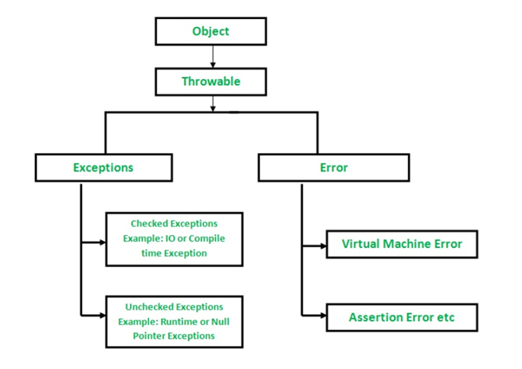

# Session 13 - Exception Handling
## Exception
- Un-expected and Un-wanted situation in the program execution is called as Exception
- Exception will disturb normal flow of the program execution
- When Exception occurred program will be terminated abnormally
- To achieve graceful termination we need to handle the exceptions occurred while program executing   
- The process of handling Exceptions is called as Exception Handling
- The main aim of Exception Handling to achieve graceful termination of the program
- In java we have so many predefined exceptions

	    	ArithematicException
	    	NullPointerException
	    	FileNotFoundException
	    	SQLException
## Exception vs Error
- Exception can be handled
- Error can't be handled

		Ex: Assertion Error, Virtual Machine Error
## Exception Types
- Exceptions are divided into 2 types

    	1) Checked Exceptions
    			Ex: IOException, FileNotFoundException, SQLException etc....
    	2) Un-Checked Exceptions : Will occur at Run time ( Compiler can't identify these exception )
    			Ex: NullPointerException, ArithematicException etc...
### Checked Exceptions
- Will be identified at compile time (occurs at run time)

		Ex: IOException, FileNotFoundException, SQLException etc....
### Un-Checked Exceptions
- Will occur at Run time (Compiler can't identify these exception)

		Ex: NullPointerException, ArithematicException etc...
## Handling Exceptions
- Java provided 5 keywords to handle exceptions

    	1) try
    	2) catch
    	3) finally
    	4) throws
    	5) throw
### try
- It is used to keep risky code
```java
	// Syntax
	try {
		// stmts
	}
```
### catch
- catch block is used to catch the exception which occurred in try block
- To write catch block , try block is mandatory
- One try block can contain multiple catch blocks also
```java
	// Syntax
	try {
		// logic
	} catch ( Exception e ){
		// logic to catch exception info
	}
```

**Note: If exception occurred in try block then only catch block will execute otherwise catch block will not execute.**

```java
	public class Demo {
		public static void main(String[] args) {
			System.out.println("main( ) method started...");
			try {
				System.out.println("try block start");
				String s = null;
				s.length(); // NPE
				System.out.println("try block end");
			} catch (Exception e) {
				System.out.println("catch block");
				e.printStackTrace();
			}
			System.out.println("main( ) method ended...");
		}
	}
```

```java
	// We can write one try block with multiple catch blocks also like below
	public class Demo {
		public static void main(String[] args) {
			System.out.println("main( ) method started...");
			try {
				System.out.println("try block start");
				String s = "hi";
				int i = s.length();
				System.out.println("try block end");
			} catch (ArithmeticException e) {
				System.out.println("catch block");
				e.printStackTrace();
			} catch (NullPointerException e) {
				e.printStackTrace();
			} catch (Exception e) {
				e.printStackTrace();
			}
			System.out.println("main() method ended...");
		}
	}
```

**Note: Catch blocks order should be child to parent.**
### finally
- It is used to perform resource clean up activities

    	Ex: file close, db connection close etc....
- finally block will execute always (irrespective of the exception)
```java
	// java program with try-catch-finally scenario
	public class Demo {
		public static void main(String[] args) {
			System.out.println("main( ) method started...");
			try {
				System.out.println("try block start");
				int i = 10 / 2;
				System.out.println("try block end");
			} catch (Exception e) {
				System.out.println("catch block");
				e.printStackTrace();
			} finally {
				System.out.println("finally block");
			}
			System.out.println("main( ) method ended...");
		}
	}
```

**Q) What is the difference between final, finalize( ) and finally ?**  
**Ans: final :** it is a keyword which is used to declare final variables, final methods and final classes.  
**finalize ( ) :** It is predefined method available in Object class, and it will be called by garbage collector before removing unused objects from heap area.  
**finally :** it is a block we will use to execute some clean activities in exception handling.

			try : it is used to keep our risky code
			catch : It is used to catch the exception occurred try block
			finally : to execute clean up activities
### throws
- It is used to hand over checked exceptions to caller method / JVM
- **Note: We can ignore checked exceptions using throws keyword.**

```java
	public class Demo {
		public static void main(String[] args) throws FileNotFoundException {
			FileReader fr = new FileReader("abc.txt");
		}
	}
```

- **Note: We can ignore all checked exceptions like below**

```java
	public class Demo {
		public static void main(String[] args) throws Exception {
			FileReader fr = new FileReader("abc.txt");
			Class.forName("");
		}
	}
```
### throw
- throw keyword is used to explicitly throw an exception
```java
	throw new Exception("Msg");
```

```java
	public class Demo {
		public String getName(int id) throws Exception {
			if (id == 100) {
				return "raju";
			} else if (id == 101) {
				return "rani";
			} else {
				throw new Exception("Invalid Id");
			}
		}

		public static void main(String[] args) throws Exception {
			Demo d = new Demo();
			String name = d.getName(101);
			System.out.println(name);

			String name1 = d.getName(200);
			System.out.println(name1);
		}
	}
```
## Exception Hierarchy

## User Defined Exceptions
- In java language we have several pre-defined exception classes

	    	IOException
	    	FileNotFoundException
	    	ClassNotFoundException
	    	SQLException
	    	AirthematicException
	    	ArrayNegativeSizeException
	    	NullPointerException
	    	ClassCastException etc...
- Based on Project requirement, sometimes we need to create our own exceptions those are called as user defined exceptions

	    	InvalidCredentialsExceptions
	    	NoRecordsFoundException
	    	NoDataFoundException
	    	InvalidInputException

- To create our own Exception we need to extend the properties from `Exception` or `RuntimeException` class
```java
	public class NoDataFoundException extends RuntimeException {
		public NoDataFoundException() {
			// logic
		}

		public NoDataFoundException(String msg) {
			super(msg);
		}
	}

	public class Demo {
		private String getName(int id) {
			if (id == 100) {
				return "Raju";
			} else if (id == 101) {
				return "Rani";
			} else {
				throw new NoDataFoundException("Invalid Id");
			}
		}

		public static void main(String[] args) {
			Demo d = new Demo();
			d.getName(200);
		}
	}
```
## JVM Reaction to Exceptions
- When an exception occurs, the program stops running normally
- The JVM creates an exception object that stores information about the exception
- The JVM looks for a `catch` block to handle the exception
- It checks the current method first
- If not found, it goes back to the previous method (this is called stack unwinding) 
- It continues checking methods one by one
- If a matching `catch` block is found, the error is handled there
- If no `catch` block is found, the JVM prints the error message and stops the program


