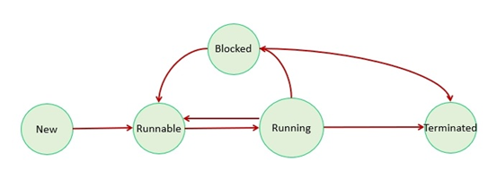

# Session 15 - Multithreading
## Threads
- A thread is the smallest unit of execution inside a program
- A program can have multiple threads running simultaneously, which is called multithreading
#### Use case to go for Multi Threading

		1) Send sms to all customers at a time
		2) Send Email to all customers at a time
		3) Generate & Send Bank Statements to all customers in email
## How to create a Thread
- In Java we can create Thread in 2 ways

			1) By extending Thread class
			2) By Implementing Runnable interface

```java
	// Java program to create user defined thread using Thread class
	public class Demo extends Thread {
		public void run() {
			System.out.println("run () method called...");
		}
		
		public static void main(String... args) {
			Demo d = new Demo();
			Thread t = new Thread(d);
			t.start();
		}
	}
```

```java
	// Java program to create the thread using Runnable interface
	public class Demo implements Runnable {
		public void run() {
			System.out.println("run () method called...");
		}
		
		public static void main(String... args) {
			Demo d = new Demo();
			Thread t = new Thread(d);
			t.start();
		}
	}
```

**Note: Implementing Runnable interface is recommended approach to create Threads.**
## Thread Life Cycle
- Thread Life cycle contains several phases of Thread execution

	    	1) New
	    	2) Runnable
	    	3) Running
	    	4) Blocked
	    	5) Terminated

**New :** A thread begins its life cycle in the new state. Thread remains in the new state until we will call start ( ) method.

**Runnable :** After calling start ( ) method, thread comes from new state to runnable state.

**Running :** A thread comes to running state when Thread Schedular will pick up that thread for execution.

**Blocked :** A thread is in waiting state if it waits for another thread to complete its task.

**Terminated :** A thread enters into terminated state once it completes its task.


## Thread Priorities
- Thread priority decides which thread should run first
- We can set the thread priority using constants

			1 → Minimum Priority
			5 → Normal Priority
			10 → Maximum Priority

```java
	// Java Program using Thread Priorty
	class MyThread extends Thread {
		public void run() {
	        System.out.println(Thread.currentThread().getName());
	    }
	    
	    public static void main(String[] args) {
		    MyThread t1 = new MyThread();
	        MyThread t2 = new MyThread();
	        
	        t1.setPriority(Thread.MAX_PRIORITY);
	        t2.setPriority(Thread.MIN_PRIORITY);
	        
	        t1.start();
	        t2.start();
	    }
	}
```

**Note: Thread priority is just a suggestion to the scheduler. It does not guarantee execution order.**
## Synchronization
- If multiple threads access the same resource at a time then there is a chance of getting data inconsistency problem
- To avoid data inconsistency problem, we need to use Synchronization concept
- Synchronization means allowing only one thread to access our resource at a time
- Using `synchronized` keyword we can implement synchronization

```java
	// Syntax For Synchronized Method
	public synchronized void m1( ) {
		// important business logic
	}
```

```java
	// Java Program with Synchronized Method
	public class Demo implements Runnable {
		public synchronized void printNums() {
			for (int i = 1; i <= 10; i++) {
				System.out.println(Thread.currentThread().getName() + "=> " + i);
				try {
					Thread.sleep(1000);
				} catch (Exception e) {
					e.printStackTrace();
				}
			}
		}
		
		public void run() {
			printNums();
		}
		
		public static void main(String[] args) {
			Demo d = new Demo();
			
			Thread t1 = new Thread(d);
			t1.setName("Thread-1");
			t1.start();
			
			Thread t2 = new Thread(d);
			t2.setName("Thread-2");
			t2.start();
		}
	}
```
## Inter Thread Communication
- It is used to establish communication among the threads    
- To achieve inter thread communication we have below 3 methods in Object class

	    	1) wait( )
	    	2) notify( )
	    	3) notifyAll( )

```java
	// Java Program to establish inter thread communication
	class Shared {
		synchronized void waitMethod() {
	        System.out.println("Thread 1: Waiting for notification...");
	        
	        try {
	            wait(); // Thread goes to waiting state
	        } catch (InterruptedException e) {
	            e.printStackTrace();
	        }
	        
	        System.out.println("Thread 1: Received notification and resumed.");
	    }
	    
	    synchronized void notifyMethod() {
	        System.out.println("Thread 2: Performing task...");
	        
	        notify(); // Notify waiting thread
	        
	        System.out.println("Thread 2: Notification sent.");
	    }
	}
	
	public class InterThreadDemo {
		public static void main(String[] args) {
			Shared obj = new Shared();
				
			Thread t1 = new Thread(() -> {
			      obj.waitMethod();
	        });
	        
	        Thread t2 = new Thread(() -> {
	            try {
	                Thread.sleep(2000); // Delay to show waiting
	            } catch (Exception e) {}
	            obj.notifyMethod();
	        });
	        
	        t1.start();
	        t2.start();
	    }
	}
```


