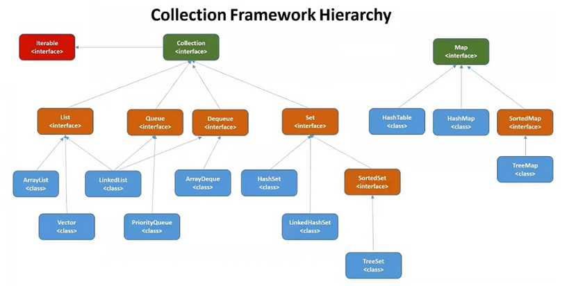

# Session 17 - Collection Framework
## Collections
- Collections are used to store group of objects / values
- We can store any type of data in Collection (homogeneous & heterogeneous)
- Collections are growable in nature
- Collections providing predefined methods to insert, update, delete, retrieve, sort etc
## Collection Framework Hierarchy
		1) Iterable (I)
		2) Collection (I)
		3) List (I)
		4) Set (I)
		5) Queue (I)
		6) Map (I)



**List :** It is used to store group of objects (duplicates are allowed)

		1) ArrayList
		2) LinkedList
		3) Vector
		4) Stack

**Set :** It is used to store group of objects (duplicates are not allowed)

		1) HashSet
		2) LinkedHashSet
		3) TreeSet

**Queue :** It is used to store group of objects (FIFO)

		1) PriorityQueue
		2) ArrayDeque

**Map :** It is used to store group of objects (key-value pair)

		1) HashMap
		2) LinkedHashMap
		3) Hashtable
		4) TreeMap
		5) IdentityHashMap
		6) WeakHashMap
## Collection Interface
- It is super interface for List, Set and Queue
- Collection interface providing several methods to store and retrieve objects
## Iterator Interface
- Iterator is a interface available in `java.util` package
- It is used to traverse (iterate) elements of a collection
- Iterator access elements one by one in forward direction

```java
	// Iterator Example
	Iterator iterator = al.iterator();
	while (iterator.hasNext()) {
		System.out.println(iterator.next());
	}
```
### List Interface
- Extending properties from Collection interface
- Allow duplicate objects
- It will maintain objects insertion order
- It is having 4 implementation classes

	    	1) ArrayList
	    	2) LinkedList
	    	3) Vector
	    	4) Stack
#### ArrayList
- Implementation class of List interface
- Duplicate objects are allowed
- Insertion order preserved
- null values are accepted
- Internal data structure of ArrayList is growable array

```java
	// Java Program using ArrayList 
	import java.util.ArrayList;
	
	public class Demo {
		public static void main(String[] args) {
			ArrayList<Integer> al = new ArrayList<>();
			al.add(10);
			al.add(20);
			al.add(30);
			al.add(40)
			
			// Using loop
			for (Integer obj : al) {
				System.out.println(obj);
			}
			
			// Using iterator
			Iterator iterator = al.iterator();
			while (iterator.hasNext()) {
				System.out.println(iterator.next());
			}
		}
	}
```
#### LinkedList
- Implementation of List interface
- Internal data structure is double linked list
- insertion order preserved
- duplicate objects are allowed
- null objects also allowed

```java
	// Java Program using LinkedList
	import java.util.LinkedList;
	
	public class Demo {
		public static void main(String[] args) {
			LinkedList<Integer> ll = new LinkedList<>();
			
			ll.add(10);
			ll.add(20);
			ll.add(30);
			ll.add(40);
			
			System.out.println(ll); // 10, 20, 30, 40
			ll.add(1, 15);
			System.out.println(ll); // 10, 15, 20, 30, 40
		}
	}
```
#### Vector
- Implementation class of List interface
- Internal data structure is growable array
- duplicates are allowed
- insertion order preserved
- Vector is called as legacy class (JDK 1.0)
#### Stack
- Implementation class of List interface
- Extending from Vector class
- Data Structure of Stack is LIFO (last in first out)

	    	push( ) ---> to insert object
	    	peek( ) ---> to get last element
	    	pop( ) ---> to remove last element
### Queue Interface
- It is extending properties from Collection interface
- It is used to store group of objects
- Internal Data structure is FIFO (First in First out)
- It is ordered list of objects
- Insertion will happen at end of the collection
- Removal will happen at beginning of the collection
### Set Interface
- Set interface extending from Collection interface
- Set is used to store group of objects
- Duplicate objects are not allowed
- Supports homogeneous & heterogeneous

	    	1) HashSet
	    	2) LinkedHashSet
	    	3) TreeSet
#### HashSet
- Implementation class of Set interface
- Duplicate Objects are not allowed
- Null is allowed
- Insertion order will not be maintained
- Initial Capacity is 16
- Internal data structure is `Hashtable`

```java
	// Java Program using HashSet
	import java.util.HashSet;
	
	public class Demo {
		public static void main(String[] args) {
			HashSet<String> hs = new HashSet<>();
			
			hs.add("one");
			hs.add("two");
			hs.add("three");
			hs.add("four");
			hs.add(null);
			
			for(String str : hs) {
				System.out.println(str);
			}
		}
	}
```
#### LinkedHasSet
- Implementation class for Set interface
- Duplicates are not allowed
- Insertion order will be preserved
- Internal Data Structure is Hash table + Double linked list
- Initial capacity 16

```java
	// Java Program using LinkedHashSet
	import java.util.LinkedHashSet;
	
	public class Demo {
		public static void main(String[] args) {
			LinkedHashSet<Integer> lhs = new LinkedHashSet<>();
			
			lhs.add(10);
			lhs.add(20);
			lhs.add(30);
			lhs.add(null);
			lhs.add(40);
			
			System.out.println(lhs);
		}
	}
```
#### SortedSet
- It is a interface of Collection Framework
- It is used to store unique elements in Sorted order
- It has one implementation class `TreeSet`
#### TreeSet
- Implementation class for Set interface
- It will maintain Natural Sorting Order
- Duplicates are not allowed
- null values are not allowed
- It supports only homogeneous data 
- Internal data structure is binary tree

```java
	// Java Program using TreeSet
	import java.util.TreeSet;
	
	public class Demo {
		public static void main(String[] args) {
			TreeSet<String> ts = new TreeSet<>();
			
			ts.add("raja");
			ts.add("raja");
			ts.add("rani");
			
			for(String str : ts) {
				System.out.println(str);
			}
		}
	}
```

**List interface & implementation classes**

		- duplicates allowed
		- insertion order maintained
		- homogenious & heterogenious data allowed
		Ex:  ArrayList, LinkedList, Vector & Stack

**Set interface & implementation classes**

		- Duplicates not allowed
		- only LHS will maintain insertion order
		- TreeSet supports only homogenious data (For sorting)
		Ex:  HashSet, LinkedHashSet & TreeSet
### Map Interface
- Map is an interface available in `java.util` package
- Map is used to store the data in key-value format
- One Key-Value pair is called as one entry
- One Map object can have multiple entries
- We can take key & value as any type of data

    	Ex:-1 : Map<Integer, String>
    			101 - John
    			102 - Smith
    			103 - David

    	Ex:-2 : Map<String, Integer>
    			India - 120
    			USA - 30
    			UK - 20
   
- Map interface having several implementation classes

	    	1) HashMap
	    	2) LinkedHashMap
	    	3) TreeMap
	    	4) Hashtable
#### HashMap
- It is implementation class for `Map` interface
- Used to store data in key-value format
- Default capacity is 16
- Underlying data structure is `hashtable`
- Insertion Order will not be maintained by HashMap

```java
	// Java Program using Map
	import java.util.HashMap;
	
	public class Demo {
		public static void main(String[] args) {
			Map<Integer, String> map = new HashMap<>();
			
			map.put(101, "John");
			map.put(102, "Smith");
			map.put(103, "Orlen");
			map.put(102, "David");
			
			System.out.println(map.get(101)); // john
			System.out.println(map.get(300)); // null
			
			for(Entry<Integer,String> entry : map.entrySet()) {
				System.out.println(entry.getKey()+"--"+entry.getValue());
			}
		}
	}
```
#### LinkedHashMap
- Implementation class for Map interface
- Maintains insertion order
- Data structure is hashtable + double linkedlist

```java
	// Java Program using LinkedHashMap
	import java.util.LinkedHashMap;
	
	public class Demo {  
		public static void main(String[] args) {  
			Map<Integer, String> map = new LinkedHashMap<>();
			
			map.put(101, "John");  
			map.put(102, "Smith");  
			map.put(103, "Orlen");  
			map.put(102, "David"); // replaces value
			
			System.out.println(map.get(101)); // John  
			System.out.println(map.get(300)); // null  
			
			for(Map.Entry<Integer,String> entry : map.entrySet()) {  
				System.out.println(entry.getKey() + "--" + entry.getValue());  
			}  
		}  
	}
```
#### TreeMap
- Implementation class for Map interface
- It maintains natural sorted order for keys
- Internal Data structure for Tree map is binary tree

```java
	// Java Program using TreeMap
	import java.util.TreeMap;
	
	public class Demo {
	    public static void main(String[] args) {
	        Map<Integer, String> map = new TreeMap<>();
	        
	        map.put(101, "John");
	        map.put(102, "Smith");
	        map.put(103, "Orlen");
	        map.put(102, "David"); // replaces value
	        
	        System.out.println(map.get(101)); // John
	        System.out.println(map.get(300)); // null
	           
	        for(Map.Entry<Integer,String> entry : map.entrySet()) {
	            System.out.println(entry.getKey() + "--" + entry.getValue());
	        }
	    }
	}
```
## Hashtable
- It is implementation class for Map interface
- Default capacity is 11
- key-value format to store the data
- `Hashtable` is legacy class (JDK 1.0v)
## Collections Sorting
- Collection is a container which is used to store group of objects
- Collection interface is available in `java.util` package
- In Collections framework we have a class called `Collections` class
- Collections is a predefined class available in `java.util` package
- Collections class provided below static method to perform sorting

    		Collections.sort(al);

```java
	// Java program on Collections class
	public class Demo {
		public static void main(String[] args) {
			ArrayList<Integer> al = new ArrayList<>();
			
			al.add(5);
			al.add(3);
			al.add(4);
			al.add(1);
			al.add(2);
			
			System.out.println("Before Sort : " + al);
			
			// Sort the collection
			Collections.sort(al);
			
			System.out.println("After Sort : " + al);
		}
	}
```

**Note: In the above program we have added Integer values in the collection. Integer is a class wrapper and it is implementing Comparable interface already.**

- If we want apply sorting on User-Defined objects like Student, Employee, Product, Customer etc... then we have 2 approaches

	    	1) Comparable (java.lang)
	    	2) Comparator (java.util)
### Comparable Interface
- Comparable is a predefined interface available in `java.lang` package
- Comparable interface having `compareTo(Object obj)` method
- `compareTo()` method is used to compare an object with itself and returns int value

    	if( obj1 > obj2 ) ----> returns +ve no
    	if( obj1 < obj2 ) ----> return -ve no
    	if ( obj1 == obj2 ) ----> return zero (0)

```java
	// Java Program using Comparable
	
	// Student class
	public class Student implements Comparable<Student> {
		int id;
		String name;
		int rank;
		
		public Student(int id, String name, int rank) {
			this.id = id;
			this.name = name;
			this.rank = rank;
		}
		
		@Override
		public int compareTo(Student s) {
			return this.id - s.id;
			// return this.name.compareTo(s.name);
			// return this.rank - s.rank;
		}
		
		@Override
		public String toString() {
			return "Student [id=" + id + ", name=" + name + ", rank=" + rank + "]";
		}
	}
	
	// StudentDemo class
	import java.util.ArrayList;
	import java.util.Collections;
	import java.util.List;
	
	public class StudentDemo {
		public static void main(String[] args) {
			List<Student> al = new ArrayList<>();
			
			al.add(new Student(101, "John", 3));
			al.add(new Student(104, "Anil", 4));
			al.add(new Student(102, "Smith", 2));
			al.add(new Student(103, "Robert", 1));
			
			Collections.sort(al);
			
			for (Student s : al) {
				System.out.println(s);
			}
		}
	}
```

**Note: Comparable interface will allow us to sort the data based on only one value. If we want to change our sorting technique then we need to modify the class which is implementing Comparable interface. Modifying the code everytime is not recommended.**
### Comparator Interface
- Comparator is a predefined interface available in `java.util` package
- Comparator interface having `compare(Object obj1, Object obj2)` method

```java
	// Java Program using Comparator
	
	// Employee class
	public class Employee {
		int id;
		String name;
		double salary;
		
		public Employee(int id, String name, double salary) {
			super();
			this.id = id;
			this.name = name;
			this.salary = salary;
		}
		
		@Override
		public String toString() {
			return "Employee [id=" + id + ", name=" + name + ", salary=" + salary + "]";
		}
	}
	
	// EmpIdComparator class
	import java.util.Comparator;
	
	public class EmpIdComparator implements Comparator<Employee> {
		@Override
		public int compare(Employee e1, Employee e2) {
			return e1.id - e2.id;
		}
	}
	
	//EmpNameComparator
	import java.util.Comparator;
	
	public class EmpNameCompartor implements Comparator<Employee> {
		@Override
		public int compare(Employee e1, Employee e2) {
			return e1.name.compareTo(e2.name);
		}
	}
	
	// EmpDemo class
	import java.util.ArrayList;
	import java.util.Collections;
	import java.util.Comparator;
	
	public class EmpDemo {
		public static void main(String[] args) {
			ArrayList<Employee> emps = new ArrayList<>();
			
			emps.add(new Employee(101, "David", 15000.00));
			emps.add(new Employee(105, "Putin", 25000.00));
			emps.add(new Employee(103, "Cathy", 45000.00));
			emps.add(new Employee(104, "Anny", 35000.00));
			
			// Collections.sort(emps, new EmpIdComparator());
			// Collections.sort(emps, new EmpNameCompartor());
			
			Collections.sort(emps, new Comparator<Employee>() {
				@Override
				public int compare(Employee e1, Employee e2) {
					if (e1.salary > e2.salary) {
						return -1;
					} else if (e1.salary < e2.salary) {
						return 1;
					} else {
						return 0;
					}
				}
			});
			
			for (Employee e : emps) {
				System.out.println(e);
			}
		}
	}
```
## Properties Class
- Properties is a predefined class available in `java.util` package
- Properties class extending properties from `hashtable` class
- Properties class is used to avoid hardcoding in the project

    	------------ database.properties ------------
    		uname=arpit
    		pwd=Arpit@123
    	---------------------------------------------

```java
	// Java Program using Properties Class
	import java.util.Properties;
	
	public class DatabaseApp {
		public static void main(String[] args) throws Exception {
			FileInputStream fis = new FileInputStream("database.properties");
			
			Properties p = new Properties();
			p.load(fis); // load all the properties from properties file
			
			String uname = p.getProperty("uname");
			String pwd = p.getProperty("pwd");
			
			System.out.println("Username: " + uname);
			System.out.println("Password: " + pwd);
			
			fis.close();
		}
	}
```


