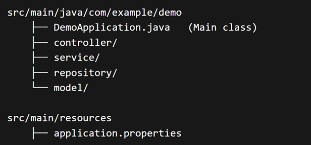

# Session 18 - Spring & Spring Boot
## Spring Framework
- Spring Framework released in 2004 (First Production Release)
- It is an application development framework
- Entire project can be developed by using Spring framework
- It is a free & open source framework
- Spring is very light weight framework
## Dependency Injection
- The process of injecting one class object into another class object is called as Dependency Injection
- We can perform Dependency Injection in 3 ways

	      	1) Setter Injection
	      	2) Constructor Injection
	      	3) Field Injection

```java
	// IPayment interface
	public interface IPayment {
		public String pay(double amount);
	}
	
	// BillCollector class
	public class BillCollector {
		private IPayment payment;
		
		public void setPayment(IPayment payment) {
			this.payment = payment;
		}
		
		public BillCollector() { }
		
		public BillCollector(IPayment payment) {
			this.payment = payment;
		}
		
		public void payBill(double amount) {
			String status = payment.pay(amount);
			System.out.println(status);
		}
	}
```
### Setter Injection
- The process of injecting one class object into another class object using setter method is called as Setter Injection.

```java
	// injecting dependent obj into target obj using setter method
	BillCollector bc = new BillCollector();
	bc.setPayment(new CreditCardPayment()); // setter injection
	bc.payBill(1400.0);
```
### Constructor Injection
- The process of injecting one class object into another class object using constructor is called as Constructor Injection

```java
	// injecting dependent obj into target obj using constructor
	BillCollector bc = new BillCollector(new DebitCardPayment()); // constructor injection
	bc.payBill(1500.0);
```
### Field Injection
- The process of injecting one class object into another class object using variable (field) is called as Field Injection
## Inversion of Control (IOC)
- IOC is a principle which is responsible to manage and collaborate dependencies among the classes available in the application
- If we develop the project using spring framework then Spring IOC will take care of dependency injections in our application
## Aspect Oriented Programming (AOP)
- AOP is used to separate cross-cutting logic from business logic

		Eg: We write separte exception handling logic
## Bean
- A java class whose life cylce is managed by the spring framework is called as a spring Bean
## Bean Scopes
- Bean scope will decide how many objects should be created for a spring bean
- The default scope of spring bean is singleton (that means only one object will be created)
- We can configure below scopes for spring bean

      	1) Singleton
      	2) Prototype
      	3) Request
      	4) Session
      	5) Application
      	6) WebSocket

- For singleton beans only one object will be created
- For prototype beans every time new object will be created
- For request scope one bean per request will be created
- For session scope one bean per session will be created
- For application scope one bean per entire app will be created
- For websocket scope one bean per websocket session
- Default scope for spring beans is singleton
## Autowiring
- Autowiring is used to perform dependency injection
- In Spring framework IOC container will perform dependency injection
- We will provide instructions to IOC to perform DI in 2 ways
- To perform autowiring we will use `@Autowired` annotation
- `@Autowired` annotation we can use at 3 places

	      	1) setter method level (Setter Injection - SI)
	      	2) constructor level (Constructor Injection - CI)
	      	3) variable level (Field Injection - FI)
## Lifecycle Callbacks in Spring
- Lifecycle callbacks are methods that Spring calls automatically at different stages of a bean’s life
- These are used to initialize the resources & cleaning up the resources
- There are two types of lifecycle callbacks

		1) Initialization Callback
		2) Destruction Callback

```java
	// Initialization Callback
	@Component
	class MyBean {
	    @PostConstruct
	    public void init() {
	        System.out.println("Bean initialized");
	    }
	}
	
	// Destruction Callback
	@Component
	class MyBean {
	    @PreDestroy
	    public void destroy() {
	        System.out.println("Bean destroyed");
	    }
	}
```
## Bean Configuration Styles
- We can configure Spring Beans in 3 ways

		1) XML Approach (Outdated)
		2) Java Config
		3) Annotations
### XML Approach
- We can define configuration using XML
```xml
	<beans>
	    <bean id="engine" class="com.example.Engine"/>
	    
	    <bean id="car" class="com.example.Car">
	        <property name="engine" ref="engine"/>
	    </bean>
	</beans>
```
### Java Config
- We can create a Java configuration class
```java
	@Configuration
	public class AppConfig {
	    @Bean
	    public Engine engine() {
	        return new Engine();
	    }
	    
	    @Bean
	    public Car car() {
	        return new Car(engine());
	    }
	}
```
### Annotations
- We can configure our Java classes using annotations directly
```java
	@Componenet
	public class Engine {
		// logic
	}
```
## Spring Boot
- It is another approach to develop spring based applications with less configurations
- Spring Boot is an enhancement of Spring framework
- Spring Boot internally uses Spring framework only (Spring Boot is not an replacement for Spring framework)
- What type of applications we can develop using spring framework, same type of applications can be developed by using Spring boot also
## Spring Boot Build Systems
### ### Maven
- Uses `pom.xml`
- XML-based configuration
```xml
	<!- Example Dependency ->
	<dependency>
	    <groupId>org.springframework.boot</groupId>
	    <artifactId>spring-boot-starter-web</artifactId>
	</dependency>
```
### ### Gradle
- Uses `build.gradle`
- Groovy/Kotlin-based (cleaner syntax)
```gradle
	implementation 'org.springframework.boot:spring-boot-starter-web'
```
## Spring Boot Code Structure

## Spring Boot Runners
- If we want to execute any logic only once when our application got started then we can use Runners concept
- Both runners are functional interface. They have only one abstract method i.e run() method
- In Spring Boot we have 2 types of Runners

      	1) ApplicationRunner
      	2) CommandLineRunner
#### Use cases
		1) send email to management once application started
		2) read data from static db tables and store into cache memory

```java
	// Spring Boot app using ApplicationRunner
	@Component
	public class CacheManager implements ApplicationRunner {
		@Override
		public void run(ApplicationArguments args) throws Exception {
			System.out.println("Logic executing to load data into cache....");
		}
	}
```

```java
	// Spring Boot app using CommandLineRunner
	@Component
	public class SendAppStartMail implements CommandLineRunner {
		@Override
		public void run(String... args) throws Exception {
			System.out.println("Logic executing to send email....");
		}
	}
```
## RESTFul Web Services (REST APIs)
- RESTFul services means one application is communicating with another application
- Distributed Applications will re-use the services of one application in another application
## Spring Boot Annotations
#### @Configuration
- Marks a class as a source of bean definitions
```java
	@Configuration  
	public class AppConfig {  
	}
```
#### @Bean
- Declares a bean manually
```java
	@Bean  
	public MyService myService() {  
	    return new MyService();  
	}
```
#### @Autowired
- Automatically injects dependencies
```java
	@Autowired  
	private MyService myService;
```
#### @Component
- Generic stereotype for any Spring-managed component
```java
	@Component  
	public class MyComponent {  
	}
```
#### @Service
- Used for business logic layer
```java
	@Service  
	public class UserService {  
	}
```
#### @Repository
- Used for DAO layer
- Handles database exceptions
```java
	@Repository  
	public class UserRepository {  
	}
```
#### @Entity
- It is used to represent Java class as DB table
```java
	@Entity
	public class Book {
	}
```
#### @Id
- It is used to represent a field as primary key
- Id can't have duplicate values
```java
	@Entity
	public class Book {
		@Id
		private Integer bookId;
		private String bookName;
		private Double bookPrice;
	}
```
#### @RestController
- Combines `@Controller + @ResponseBody`
- Returns JSON directly
```java
	@RestController  
	public class ApiController {  
	}
```
#### @RequestMapping
- Maps HTTP requests
```java
	@RequestMapping("/api")
```
#### @GetMapping
- It is used to handle get request
```java
	@GetMapping("/users")
```
#### @PostMapping
- It is used to handle post request
```java
	@PostMapping("/users")
```
#### @PutMapping
- It is used to handle put request
```java
	@PutMapping("/users/{id}")
```
#### @DeleteMapping
- It is used to handle delete request
```java
	@DeleteMapping("/users/{id}")
```
#### @PathVariable
- It is used to take the input frpm the url directly
```java
	@GetMapping("/users/{id}")  
	public String getUser(@PathVariable int id) {  
	    return "User " + id;  
	}
```
#### @RequestParam
- Extracts values from query parameters
```java
	@GetMapping("/search")
	public String searchUser(@RequestParam String name) {
	    return "Searching for: " + name;
	}
```
#### @RequestBody
- Maps JSON request data to Java object
```java
	@PostMapping("/users")
	public User createUser(@RequestBody User user) {
	    return user;
	}
```


